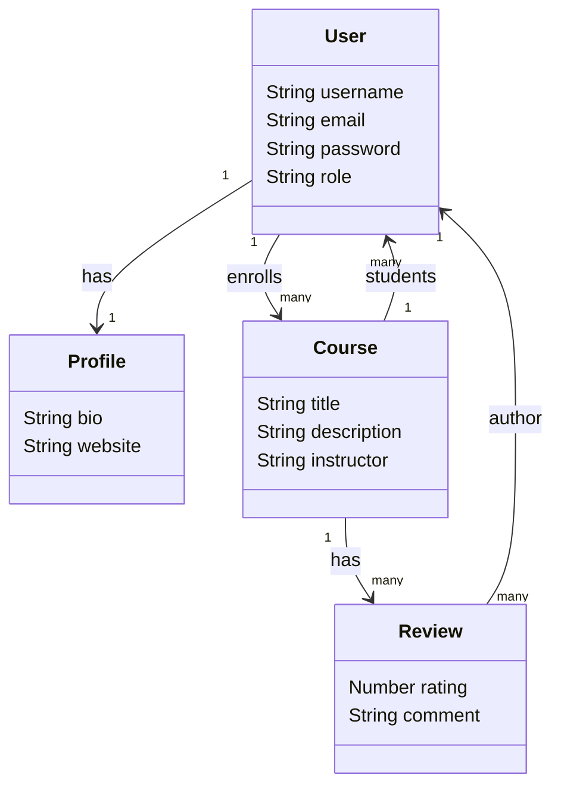

# EduPlatform (MERN)

English / Français — Full-stack course platform with JWT auth, enrollments, reviews, and admin course management.

## Demo / Démo


## What's Inside / Contenu
- Auth (register, login, `/auth/me`) with JWT + roles (admin/user)
- Courses (list, details, enroll, students, reviews 1–5)
- Admin-only course creation (server enforced)
- Profiles (bio, website, enrolled courses)
- React + Vite UI with protected routes and SweetAlert2 notifications

## Stack
- Backend: Node.js, Express, Mongoose, JWT, bcrypt, cors, morgan
- Frontend: React, Vite, React Router, Axios, SweetAlert2

## Structure
```
EduPlatform/
  server/    # API (Express, MongoDB)
  client/    # Frontend (React + Vite)
```

## UML (Mermaid)


## Prereqs / Prérequis
- Node.js >= 16
- MongoDB (local or Atlas)
- npm or yarn

## Backend Setup / Backend
```bash
cd server
npm install
```

Create `server/.env`:
```env
PORT=3000
MONGODB_URI=your_mongodb_uri
JWT_SECRET=your_strong_secret
ADMIN_EMAILS=admin@example.com,seeder@example.com
```
- `ADMIN_EMAILS`: comma-separated emails granted admin role.

Run:
```bash
npm start    # production
npm run dev  # nodemon if configured
```
API base: `http://localhost:3000/api`

## Frontend Setup / Frontend
```bash
cd client
npm install
```

Optional `client/.env`:
```env
VITE_API_URL=http://localhost:3000/api
```

Run dev server:
```bash
npm run dev
```
Vite default: `http://localhost:5173`

## Key API Routes / Routes utiles
- `POST /api/auth/register` — register
- `POST /api/auth/login` — login
- `GET /api/auth/me` — current user
- `GET /api/courses` — list
- `POST /api/courses` — create (admin)
- `POST /api/courses/:courseId/enroll` — enroll (auth)
- `GET /api/courses/:courseId/reviews` — list reviews
- `POST /api/courses/:courseId/reviews` — add review (auth + enrolled)
- `GET /api/users/:userId/courses` — enrolled courses (auth)
- `GET /api/users/:userId/profile` — profile (auth)
- `POST/PUT /api/users/:userId/profile` — create/update profile (auth)

## Tips / Astuces
- If you get 401, re-login and ensure `Authorization: Bearer <token>` is sent.
- Add admins by listing their emails in `ADMIN_EMAILS`, then have them log in.
- Override client base URL with `VITE_API_URL` when not on localhost.

## Author / Auteur
Hedyene Mili

---
